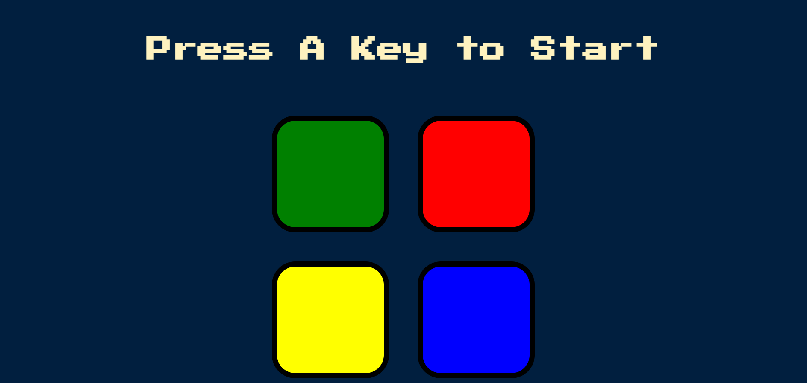

# Simon Game Website

Welcome to the Simon Game website repository! This is a web-based implementation of the classic Simon game using HTML, CSS, JavaScript, and jQuery. The game challenges players to remember and repeat sequences of colors and sounds.

## Preview

Here's a preview of the Simon website:



## How to Play
* Open index.html in a web browser.
* Follow the sequence of colors and sounds played by the game.
* Use your mouse or keyboard to repeat the sequence.
* Progress through levels by correctly replicating the sequences.

## Sound Effects
The Simon Game uses the following sound effects stored in the sounds folder:

* green.mp3: Sound for the green button.
* red.mp3: Sound for the red button.
* blue.mp3: Sound for the blue button.
* yellow.mp3: Sound for the yellow button.
* wrong.mp3: Sound played when the player makes a mistake.


## Broadcast Link

Visit my website here: https://utkarsh1244p.github.io/Simon-Game/

## Installation

To run the Simon Game Website locally, follow these steps:

1. **Clone the repository:**

   ```bash
   git clone https://github.com/Utkarsh1244p/Simon-Game.git

2. **Navigate into the project directory:**

   ```bash
   cd simon-game

3. **Open the index.html file in your web browser.**

## Folder Structure
The repository has the following structure:
```bash
simon-game/
├── index.html
├── styles/
│   └── styles.css
├── scripts/
│   └── game.js
└── sounds/
    └── green.mp3
    └── red.mp3
    └── blue.mp3
    └── yellow.mp3
    └── wrong.mp3


